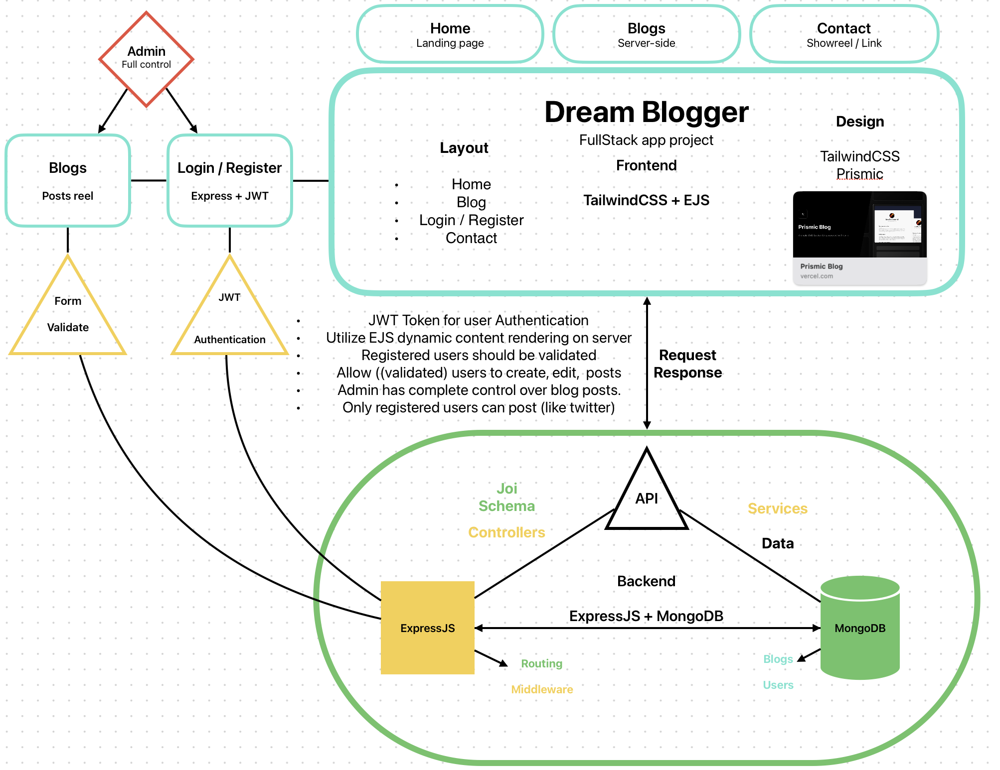

# Dream Blogger

A Full-stack Web App made as a part of a [RobotDreams](https://github.com/nightguarder/RobotDreams.git) course.

DreamBlogger is a web application that uses latest frameworks functionalities for building apps. It has features like efficient SSR page loading, EJS Templates, User Authentication with GitHub, comments and blog posts...

__Frontend:__
- `TailwindCSS`, `EJS` & `Next.js`

__Backend:__
- `MongoDB`, ``Express.js`` & `Joi`

## Schema



## Features

- [ ] User Login and JWT Auth
- [ ] First Blog post
- [ ] Users can log in, create new post and comment.
- [ ] Quick search for a posted blog
- [ ] TailwindCSS template

## Documentation
*Frameworks used:*
- [MongoDB Methods](https://github.com/nightguarder/DreamBlogger.git)
- [Joi Schema Validation](https://joi.dev/api/?v=17.9.1)
- [Next.js](https://nextjs.org/docs)
- [EJS](https://ejs.co)
- [TailwindCSS](https://tailwindcss.com/docs/installation/using-postcss)

## Development
**To run the project locally you can:** 
1. Clone this repository

 ```javascript
   git clone git@github.com:nightguarder/DreamBlogger.git 
   ```

2. Navigate to the repository & Install dependencies:

 ```javascript
  cd DreamBlogger
    npm install 
  ```
3. For development mode with live reloading run:
 ```
  npm run dev 
  ```
  
 3. To build and start the project in production mode, run:
 ``` 
 npm run start
 ```

## Notes

> __EJS__ 
- Is a template engine for Express.js that uses views directory that employs dynamic content rendering on the server-side and loads only the HTML content to the client.
- **[Layout](https://www.npmjs.com/package/express-ejs-layouts)** EJS uses its own view engine to display your templates (views) that are divided into 3 main sections {pages, partials, layouts}
- Again it was difficult to figure out on the first try, but I managed to handle it since it sorta works like Svelte. In your views directory you can utilize directories with .ejs layout, pages, partials.
- **partials:** *partials are code blocks that are reused many times such ass header, footer, navbar*
- **Routing:** res.render('.ejs location starting under views/... ', { variables, data etc. });


> __Static files__
- In order to allow the user render css, img, scripts that you create in your /public folder you need to serve them to the client.
- To serve static files such as images, CSS files, and JavaScript files, use the **[Express.static](https://expressjs.com/en/starter/static-files.html)** built-in middleware function in Express.

> __ExpressJS__
- Middleware func should be handled at the end of the Express App configuration.

> __TailwindCSS__
- Managing TailwindCSS classes and building templates without a component library can be difficult and very time consuming. Previously I had experience building with Daisy UI but this wouldn't fit the theme of the blog.
- Therefore, I choose [Preline](https://preline.co/index.html) an open-source component library that is minimalistic and has some free example templates to build from.