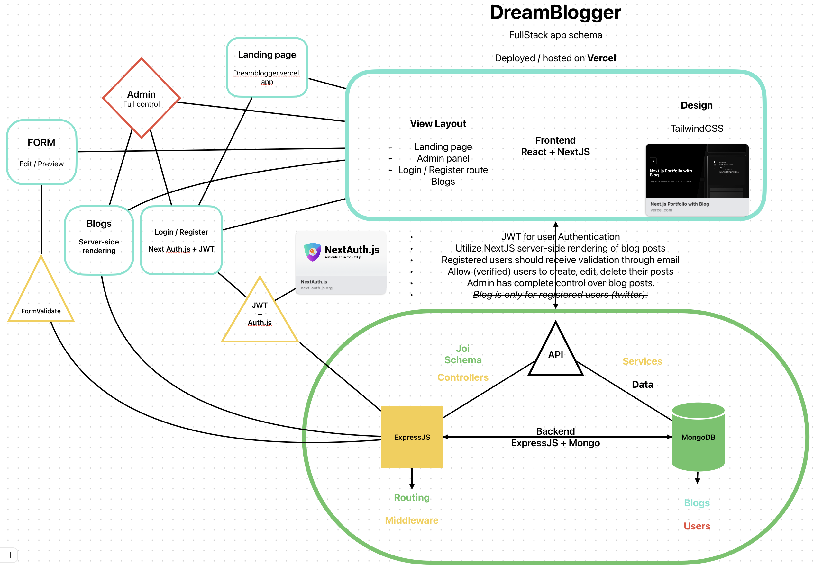

# DreamsBlogger

**A Full-stack Web App made as a part of a [RobotDreams](https://github.com/nightguarder/RobotDreams.git) course.**

DreamsBlogger is a web application that uses latest frameworks functionalities.This platform is designed for individuals to share and document their personal journeys, aspirations, and progress.

# Schema

# Features

- [ ] User Login and JWT Auth

# Documentation

- [MongoDB Methods](https://github.com/nightguarder/DreamBlogger.git)
- [Joi Schema Validation](https://joi.dev/api/?v=17.9.1)
