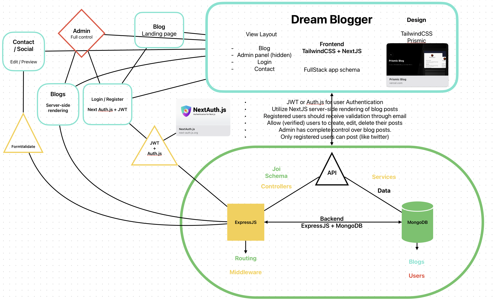

# Dream Blogger

A Full-stack Web App made as a part of a [RobotDreams](https://github.com/nightguarder/RobotDreams.git) course.

DreamBlogger is a web application that uses latest frameworks functionalities. It has features like efficient SSR page loading, User Authentication with GitHub, comments and blog posts...

__Frontend__
- `TailwindCSS` and `Next.js`

__Backend__
- `MongoDB` and ``Express.js`` 

# Schema

# Features

- [ ] User Login and JWT Auth
- [ ] First Blog post
- [ ] Users can log in, create new post and comment.

# Documentation

- [MongoDB Methods](https://github.com/nightguarder/DreamBlogger.git)
- [Joi Schema Validation](https://joi.dev/api/?v=17.9.1)
- [Next.js](https://nextjs.org/docs)
