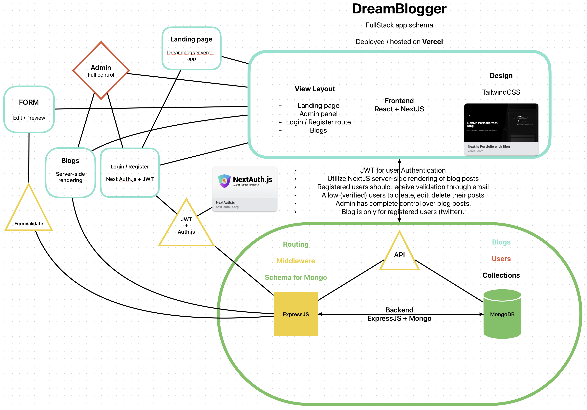

# Personal Blogg

**A Full-stack Web App made as a part of a [RobotDreams](https://github.com/nightguarder/RobotDreams.git) course.**

Personal blogg is a web application that uses latest frameworks functionalities, such as **Prismic**, **Next.js**, **MongoDB** and **ExpressJS** to create a seamless and efficient personal website with User Authentication and Communication..

# Schema

# Features

- [ ] User Login and JWT Auth
- [ ] 

# Documentation

- [MongoDB Methods](https://github.com/nightguarder/DreamBlogger.git)
- [Joi Schema Validation](https://joi.dev/api/?v=17.9.1)
