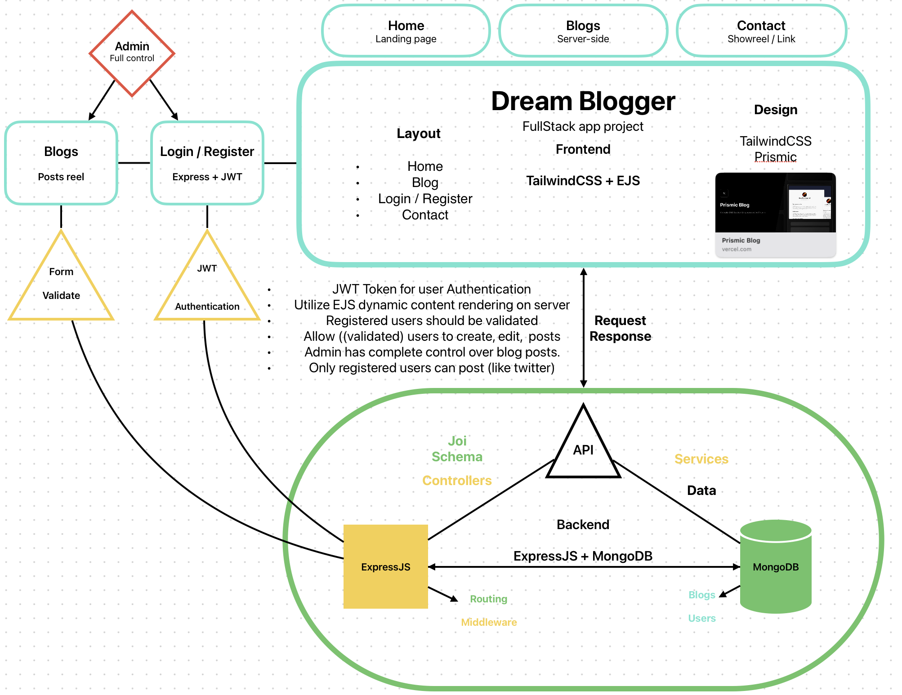

# Dream Blogger

A Full-stack Web App made as a part of a [RobotDreams](https://github.com/nightguarder/RobotDreams.git) course.

DreamBlogger is a web application that uses latest frameworks functionalities. It has features like efficient SSR page loading, EJS Templates, User Authentication with GitHub, comments and blog posts...

__Frontend__
- `TailwindCSS`, `EJS` and `Next.js`

__Backend__
- `MongoDB` and ``Express.js`` 

# Schema

# Features

- [ ] User Login and JWT Auth
- [ ] First Blog post
- [ ] Users can log in, create new post and comment.
- [ ] Quick search for a posted blog

# Documentation

- [MongoDB Methods](https://github.com/nightguarder/DreamBlogger.git)
- [Joi Schema Validation](https://joi.dev/api/?v=17.9.1)
- [Next.js](https://nextjs.org/docs)
- [EJS](https://ejs.co)

# Notes
### EJS
- Is a template engine for Express.js that uses views directory that employs dynamic content rendering on the server-side and loads only the HTML content to the client.
- 
**Routing**
- Again it was difficult to figure out on the first try, but I managed to handle it since it sorta works like Svelte. In your views directory you can utilize directories with .ejs layout, pages, partials.
- **partials:** *partials are code blocks that are reused many times such ass header, footer, navbar*
- **Routing:** res.render('.ejs location starting under views/... ', { variables, data etc. });